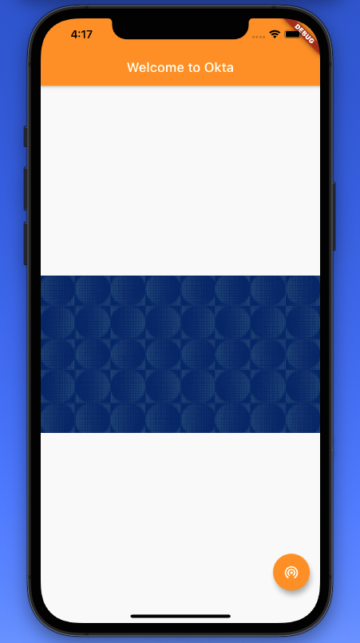

## okta_flutter

# Getting Started
A new Flutter project for integrating with Okta

This project is a starting point for a Flutter application.

A few resources to get you started if this is your first Flutter project:
1. You want to make sure you have installed Flutter
2. You also want to make sure you have Android Studio IDE
3. Watch the net ninja flutter videos on youtube and learn quick
